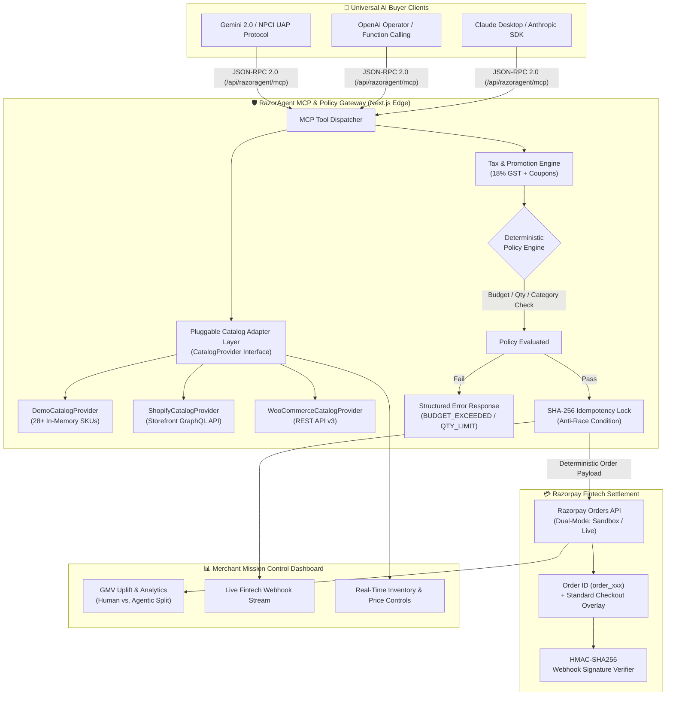

# ⚡ RazorAgent by Resence

> **Bounded Model Context Protocol (MCP) Commerce & Settlement Gateway for Autonomous AI Buyers**  
> **Engineered by:** Resence · Piyush Singh  
> **Package Version:** `v1.1.2` (Zero-Dependency Node.js SDK & Standalone CLI)  
> **Live Production Gateway:** [https://razoragent.resence.in](https://razoragent.resence.in)  
> **NPM Package Registry:** [https://www.npmjs.com/package/razoragent](https://www.npmjs.com/package/razoragent)  
> **MCP JSON-RPC Endpoint:** `https://razoragent.resence.in/api/razoragent/mcp`  
> **Install Command:** `npm install razoragent`

---

## 🎯 1. What RazorAgent Solves

Traditional e-commerce is built for **human eyes and fingers**—visual layouts, CSS styling, clickable DOM buttons, and human-in-the-loop OTP checkouts.

By 2026, commerce is transitioning to **Autonomous AI Agents** (OpenAI Operator, Claude Computer Use, Gemini Agentic Workflows, NPCI Unified Agent Protocol) researching and purchasing on behalf of consumers and enterprises.

However, letting AI agents interact directly with legacy checkout endpoints creates 4 critical failure modes:
1. **Financial Hallucinations**: LLMs generating fabricated price amounts or ordering invalid product variants.
2. **Double-Billing from Network Jitter**: AI agents retrying timed-out requests and triggering duplicate payment orders.
3. **Unbounded Spending**: No mathematical guarantee that an agent won't exceed user budgets or liquidate inventory.
4. **Lack of Standardized Tooling**: Fragile web scraping instead of structured tool interfaces.

**RazorAgent by Resence** bridges this gap. It turns any merchant store (Shopify, WooCommerce, or custom databases) into a standardized **Model Context Protocol (MCP)** server, enabling AI shopping agents to discover products, compute tax-accurate quotes, and complete transactions through **Razorpay APIs**—backed by **deterministic mathematical guardrails** and **SHA-256 cryptographic idempotency locks**.

---

## 🏛️ 2. System Architecture & Universal MCP Availability

RazorAgent is an open, universally accessible gateway. Any AI agent (Claude Desktop, OpenAI Operator, Gemini CLI, Cursor, or custom Python agent) connects via standard **JSON-RPC 2.0**:



---

## 🛠️ 3. Standardized MCP Commerce Tools

RazorAgent exposes 6 standard Model Context Protocol tools via JSON-RPC 2.0 (`/api/razoragent/mcp`):

| Tool Name | Parameters | Purpose |
| :--- | :--- | :--- |
| `search_products` | `query`, `category`, `max_price`, `min_rating` | Category-aware product search and filtering across merchant inventory. |
| `get_product_details` | `product_id` | Full technical specs, live inventory, and eligible coupon codes. |
| `calculate_cart_quote` | `items[]`, `coupon_code` | Computes subtotal, coupon discount, 18% GST tax, and shipping. |
| `evaluate_spend_policy` | `cart_id` | Deterministically validates compliance against merchant guardrails. |
| `create_guarded_order` | `cart_id`, `idempotency_key`, `buyer_email` | Creates verified Razorpay Order with SHA-256 race-condition locking. |
| `verify_payment_and_settle`| `order_id`, `payment_id`, `signature` | Cryptographic HMAC-SHA256 verification of payment completion. |

---

## ⚡ 4. High-Availability Engineering: The Concurrency Challenge

### The Problem: The LLM Non-Deterministic Retry Race Condition
During stress testing with concurrent autonomous shopping agents, simulated network jitter (1.5-second latency on order creation) triggered a critical issue:

The AI Buyer Agent assumed the request had timed out, hallucinatively mutated its nonce, and fired a concurrent retry of `create_guarded_order`. Because standard payment deduplication relied on client-supplied tokens, both requests reached the order creation pipeline 20 milliseconds apart, generating duplicate orders for a single cart.

### The Engineering Solution:

1. **Canonical SHA-256 Fingerprinting:** An immutable payload fingerprint:
```
Hash = SHA256(agent_id + canonical_sorted_cart_items + total_amount + time_window)
```

2. **Two-Phase Concurrency Latch:** In-memory promise locking with atomic state transitions:
```
INITIATED ───► LOCKED ───► ORDER_CREATED ───► CAPTURED
```
Any concurrent thread hitting the gateway while an order is in-flight is held on the same promise and receives the cached `order_xxx` ID without firing duplicate Razorpay API calls.

3. **Structured Semantic Interception Feedback:** Rather than returning a generic HTTP 409 conflict, the gateway returns `IDEMPOTENCY_RETRY_SUPPRESSED` with the active order receipt, allowing the agent to proceed to payment confirmation seamlessly.

*(You can verify this automatically via `npx razoragent test` or the **"Run Tests"** button in the dashboard navbar!)*

---

## 🔌 5. Connecting Your Real Store (Shopify / WooCommerce / Custom)

RazorAgent uses a pluggable **`CatalogProvider`** contract. It ships with:
1. **`DemoCatalogProvider`**: Zero-configuration reference catalog with 28+ products across 7 categories.
2. **`ShopifyCatalogProvider`**: Real production GraphQL adapter for Shopify Storefront API (`/api/2024-01/graphql.json`).
3. **`WooCommerceCatalogProvider`**: Real REST adapter for WooCommerce (`/wp-json/wc/v3/products`).

### CLI Store Onboarding Wizard
Connect your real merchant store in seconds via the interactive CLI wizard:
```bash
npx razoragent connect
```
The wizard guides you through selecting your platform (Shopify or WooCommerce), entering your storefront access credentials, performing an automated live SKU discovery verification, and saving your configuration into `.env.local`.

Check your active catalog source and status anytime:
```bash
npx razoragent status
```

### Web Dashboard Onboarding
Visit the live onboarding portal at [https://razoragent.resence.in/connect](https://razoragent.resence.in/connect) or click **"Connect Store"** in the top navigation bar to link your Shopify or WooCommerce store with instant live product previews.

### Writing a Custom Merchant Adapter (~15 lines)
Any custom database, ERP, or headless backend can plug into RazorAgent by implementing the 3-method `CatalogProvider` contract:

```typescript
import { CatalogProvider, CatalogSearchFilters, ProductItem, MCPEngine } from 'razoragent';

export class CustomPostgresCatalogProvider implements CatalogProvider {
  async searchProducts(query: string, filters?: CatalogSearchFilters): Promise<ProductItem[]> {
    // 1. Query your database with query & filters
    const rows = await db.query('SELECT * FROM products WHERE name ILIKE $1', [`%${query}%`]);
    return rows.map((r) => ({
      id: r.sku,
      name: r.title,
      category: r.category,
      price: r.price_inr,
      rating: 4.8,
      reviewCount: 120,
      stock: r.stock_quantity,
      description: r.description,
      specs: { brand: r.brand },
      tags: r.tags,
      image: r.image_url,
    }));
  }

  async getProductDetails(productId: string): Promise<ProductItem | null> {
    const r = await db.queryOne('SELECT * FROM products WHERE sku = $1', [productId]);
    return r ? { id: r.sku, name: r.title, category: r.category, price: r.price_inr, rating: 4.8, reviewCount: 120, stock: r.stock_quantity, description: r.description, specs: {}, tags: [], image: r.image_url } : null;
  }

  getProviderName(): string {
    return 'Custom Postgres Enterprise Catalog';
  }
}

// Register with RazorAgent MCP Engine
const engine = new MCPEngine(new CustomPostgresCatalogProvider());
```

---

## 🚀 6. Quick Start & Command Reference

### Option A: Try Instantly with Demo Data (Zero Config)
```bash
# Simulate an autonomous AI agent purchasing running shoes within ₹2,000 spend cap
npx razoragent run --intent "Buy running shoes under 2000"
```

### Option B: Connect Your Real Merchant Store
```bash
# 1. Run the interactive merchant onboarding wizard
npx razoragent connect

# 2. Check active catalog status
npx razoragent status

# 3. Simulate an AI buyer purchasing from your live catalog
npx razoragent run --intent "Find mechanical keyboard with coupon AGENT500"
```

### CLI Command Reference

| Command | Purpose |
| :--- | :--- |
| `npx razoragent connect` | Interactive merchant wizard to connect real Shopify or WooCommerce storefronts. |
| `npx razoragent status` | Displays active catalog provider (`🟢 LIVE` vs `🟡 DEMO`) and guardrail limits. |
| `npx razoragent run --intent "<text>"` | Simulates an autonomous AI buyer executing product discovery, quoting, and Razorpay order creation. |
| `npx razoragent test` | Runs the automated 6/6 fintech verification suite (100% assertion rate). |
| `npx razoragent tools` | Lists all 6 standardized Model Context Protocol (MCP) commerce tools. |
| `npx razoragent catalog` | Dumps current merchant SKUs, inventory counts, and price lists. |

---

## 🧪 7. Automated Verification Suite (6/6 Passing)

RazorAgent includes automated system verification suites accessible via `npm run test:razoragent` or the **"Run Tests"** button on the web UI:

```bash
Running RazorAgent Automated Test Suite...

Summary: 6/6 passed (100% Assertion Rate)

[PASSED] TEST_01_HAPPY_PATH: Happy Path Autonomous Agent Checkout (93ms)
[PASSED] TEST_02_BUDGET_GUARDRAIL: Deterministic Budget Cap Enforcement (2ms)
[PASSED] TEST_03_QUANTITY_GUARDRAIL: SKU Hoarding & Quantity Bounds Enforcement (1ms)
[PASSED] TEST_04_2AM_RACE_CONDITION: Concurrency & Duplicate Retry Suppression (0ms)
[PASSED] TEST_05_HMAC_WEBHOOK_VERIFY: HMAC-SHA256 Cryptographic Webhook & Settlement Verifier (1ms)
[PASSED] TEST_06_PLUGGABLE_CATALOG: Pluggable CatalogProvider Contract & Resolution (1ms)
```

---

## 🏬 8. Next.js / Express Gateway Deployment

```typescript
// Example: Exposing RazorAgent MCP tools on any Next.js / Express merchant backend
import { handleMCPRequest } from 'razoragent';

export async function POST(req: Request) {
  const jsonRpcBody = await req.json();
  const response = await handleMCPRequest(jsonRpcBody, {
    maxSpendLimitINR: 5000,
    allowedCategories: ['electronics', 'apparel', 'specialty-coffee'],
    maxQuantityPerItem: 3
  });
  return Response.json(response);
}
```

---

## 📄 License
MIT License © 2026 Resence. Open source.
