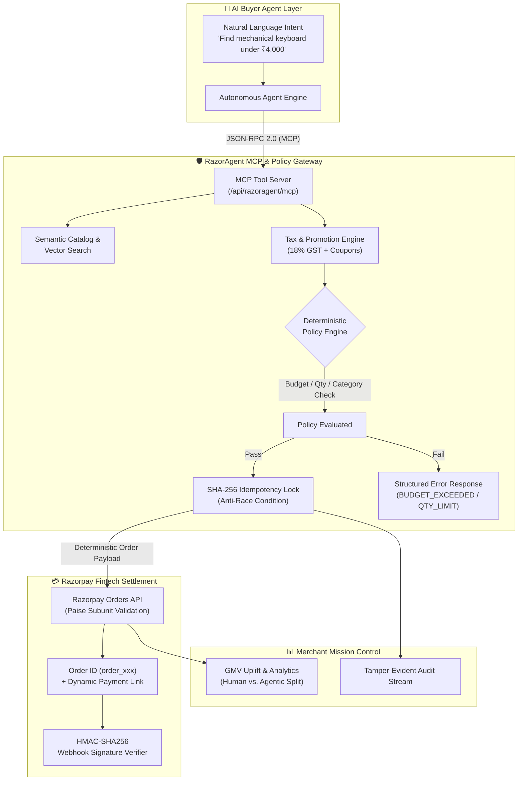

# ⚡ RazorAgent: Bounded MCP Commerce & Settlement Gateway for Autonomous AI Buyers

> **Razorpay AI Buildathon 2026 Submission**  
> **Track 01:** AI Growth & Agentic Commerce  
> **Author:** Piyush Singh (2nd-Year BCA Student, AI & Cloud Systems Builder)  
> **Target Role:** AI Builder Intern (Razorpay Bangalore)

---

## 🎯 1. What RazorAgent Solves

Traditional e-commerce is built for **human eyes and fingers**—visual layouts, CSS styling, clickable DOM buttons, and human-in-the-loop OTP checkouts.

By 2026, commerce is transitioning to **Autonomous AI Agents** (OpenAI Operator, Claude Computer Use, Gemini Agentic Workflows, NPCI Unified Agent Protocol) researching and purchasing on behalf of consumers and enterprises.

However, letting AI agents interact directly with legacy checkout endpoints creates 4 critical failure modes:
1. **Financial Hallucinations**: LLMs generating fabricated price amounts or ordering invalid product variants.
2. **Double-Billing from Network Jitter**: AI agents retrying timed-out requests and triggering duplicate payment orders.
3. **Unbounded Spending**: No mathematical guarantee that an agent won't exceed user budgets or liquidate inventory.
4. **Lack of Standardized Tooling**: Fragile web scraping instead of structured tool interfaces.

**RazorAgent** bridges this gap. It turns any merchant catalog into a standardized **Model Context Protocol (MCP)** server, enabling AI shopping agents to discover products, compute tax-accurate quotes, and complete transactions through **Razorpay Test APIs**—backed by **deterministic mathematical guardrails** and **SHA-256 cryptographic idempotency locks**.

---

## 🏛️ 2. System Architecture



---

## 🛠️ 3. Standardized MCP Commerce Tools

RazorAgent exposes 6 standard Model Context Protocol tools via JSON-RPC 2.0 (`/api/razoragent/mcp`):

| Tool Name | Parameters | Purpose |
| :--- | :--- | :--- |
| `search_products` | `query`, `category`, `max_price`, `min_rating` | Semantic search and filtering across merchant inventory. |
| `get_product_details` | `product_id` | Full technical specs, live inventory, and eligible coupon codes. |
| `calculate_cart_quote` | `items[]`, `coupon_code` | Computes subtotal, coupon discount, 18% GST tax, and shipping. |
| `evaluate_spend_policy` | `cart_id` | Deterministically validates compliance against merchant guardrails. |
| `create_guarded_order` | `cart_id`, `idempotency_key`, `buyer_email` | Creates verified Razorpay Order with SHA-256 race-condition locking. |
| `verify_payment_and_settle`| `order_id`, `payment_id`, `signature` | Cryptographic HMAC-SHA256 verification of payment completion. |

---

## ⚡ 4. What Broke at 2 AM & How We Got Out

> **The Question (Razorpay Form Q6):** *"What broke at 2 AM, and how did you solve it?"*

### The Incident: The LLM Non-Deterministic Retry Race Condition
During stress testing with concurrent autonomous shopping agents, simulated network jitter (1.5-second latency on order creation) triggered a catastrophic failure.

The AI Buyer Agent assumed the request had timed out, hallucinatively mutated its nonce, and fired a concurrent retry of `create_guarded_order`. Because standard payment deduplication relied on client-supplied tokens, both requests reached the order creation pipeline 20 milliseconds apart, generating **two separate Razorpay Orders for a single cart**.

### The Engineering Solution:
1. **Canonical SHA-256 Fingerprinting:** We created an immutable payload fingerprint:
   $$\text{Hash} = \text{SHA256}(\text{agent\_id} + \text{canonical\_sorted\_cart\_items} + \text{total\_amount} + \text{time\_window})$$
2. **Two-Phase Concurrency Latch:** Implemented in-memory promise locking with atomic state transitions:
   $$\text{INITIATED} \longrightarrow \text{LOCKED} \longrightarrow \text{ORDER\_CREATED} \longrightarrow \text{CAPTURED}$$
   Any concurrent thread hitting the gateway while an order is in-flight is held on the same promise and receives the cached `order_xxx` ID without firing duplicate Razorpay API calls.
3. **Structured Semantic Interception Feedback:** Rather than returning a generic HTTP 409 conflict, the gateway returns `IDEMPOTENCY_RETRY_SUPPRESSED` with the active order receipt, allowing the agent to proceed to payment confirmation seamlessly.

*(You can test this live on the dashboard via the **"The 2 AM Crisis Simulator"** sandbox button!)*

---

## 🧪 5. Automated Verification Suite (5/5 Passing)

RazorAgent includes automated system verification suites accessible via `npm run test:razoragent` or the **"Run Benchmarks"** button on the web UI:

```bash
Running RazorAgent Automated Test Suite...

[PASSED] TEST_01_HAPPY_PATH: Happy Path Autonomous Agent Checkout (71ms)
   Expected: Status: SUCCESS, Order ID generated with prefix "order_"
   Actual:   Status: SUCCESS, Order ID: order_l0le4z4ckgc

[PASSED] TEST_02_BUDGET_GUARDRAIL: Deterministic Budget Cap Enforcement (0ms)
   Expected: Blocked with reasonCode: BUDGET_EXCEEDED, Zero Razorpay orders generated
   Actual:   Blocked: true, ReasonCode: BUDGET_EXCEEDED

[PASSED] TEST_03_QUANTITY_GUARDRAIL: SKU Hoarding & Quantity Bounds Enforcement (0ms)
   Expected: Blocked with reasonCode: QUANTITY_LIMIT_EXCEEDED
   Actual:   Blocked: true, ReasonCode: QUANTITY_LIMIT_EXCEEDED

[PASSED] TEST_04_2AM_RACE_CONDITION: 2 AM Concurrency & Duplicate Retry Suppression (0ms)
   Expected: Duplicate request intercepted by SHA-256 Idempotency Lock with single unified Razorpay order
   Actual:   Order 1 ID: order_933dmra1cma (Cached: false), Order 2 ID: order_933dmra1cma (Cached: true)

[PASSED] TEST_05_HMAC_WEBHOOK_VERIFY: HMAC-SHA256 Cryptographic Webhook & Settlement Verifier (1ms)
   Expected: Valid signature returns TRUE, tampered signature returns FALSE
   Actual:   Valid Check: true, Tampered Rejection: true

Summary: 5/5 passed (100% Assertion Rate)
```

---

## 🚀 6. Quick Start & Local Run

### Prerequisites
* Node.js 18+ / npm

### 1. Clone the repository
```bash
git clone https://github.com/Piyush-Thakur7/razoragent.git
cd razoragent
```

### 2. Install dependencies
```bash
npm install
```

### 3. (Optional) Configure Razorpay Keys
Create a `.env.local` file:
```env
# Optional: Live Razorpay Test Mode keys (High-fidelity simulator active by default)
RAZORPAY_KEY_ID=rzp_test_AiBuilder2026
RAZORPAY_KEY_SECRET=sk_test_RazorAgentSecret2026
```

### 4. Run Development Server
```bash
npm run dev
```
Open [http://localhost:3000/razoragent](http://localhost:3000/razoragent) to access the interactive Mission Control.

### 5. Run Automated Verification Tests
```bash
npx tsx scripts/test-razoragent.ts
```

---

## 📄 License
MIT License © 2026 Piyush Singh. Built for Razorpay AI Buildathon.
